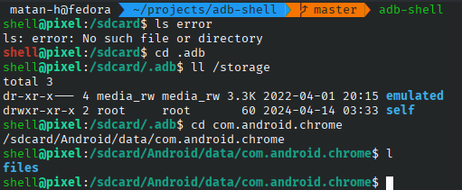

# Better `adb shell`.
This repo uses the options of [mksh](https://manpages.ubuntu.com/manpages/xenial/man1/mksh.1.html) (the android default shell) to get a better shell.

## Features

### General
* Colored prompt with path and color difference between successes and fail statuses:



* Keyboard shortcuts, such as `ctrl+l` to clear the screen (in normal `adb shell` it's a shortcut for 'enter' for some reason).
* `CDPATH`: you can `cd` to any directory in `/sdcard`, `Android/data` or `/` without typing the full path 
(for example `cd com.android.chrome` even when you are in `/` directory)

### ls aliases
* `ls` with color by default.
* shortcuts like `ll` and `la`. 
* one alias to fix the typo `sl` => `ls`.

### More aliases
* basic commands: `rd` (`rmdir`) and `md` (`mkdir`).
* `cls`(clear the screen)
* `rmtree` (remove folder)
* `..` and `cd..` => `cd ..`
* `untar` (=> `tar xvf`)

## Installation
clone this repo:
```bash
git clone https://github.com/matan-h/adb-shell
```
### Linux/macOS
`chmod +x` and run the `adb-shell.sh` file
(it's a short file, highly recommend you go and read [it](https://github.com/matan-h/adb-shell/blob/main/adb-shell.sh) [and possibly also the `startup.sh` file] before executing)
```bash
chmod +x adb-shell.sh
./adb-shell.sh
```
This will create the startup file for the `mksh` shell if it doesn't exist, and start the better `adb shell`.

To make this `adb-shell` globally accessible ether add this to your `$PATH` or add an `alias` to this file:
```bash 
# add this to your .rc file
alias adb-shell="<PATH TO THIS REPO>/adb-shell.sh"
```
### Windows
Run the `adb-shell.ps1` script (it's a short file, highly recommend you go and read [it](https://github.com/matan-h/adb-shell/blob/main/adb-shell.ps1) [and possibly also the `startup.sh` file] before executing)
```powershell
powershell -executionpolicy bypass -File .\adb-shell.ps1
```
To make this `adb-shell` globally accessible ether add this to your `$PATH` or add an `alias` to this file:

```powershell
# add this to your powershell $PROFILE file (most likely $HOME\Documents\PowerShell\Microsoft.PowerShell_profile.ps1)
set-alias "adb-shell" "<PATH TO THIS REPO>\adb-shell.ps1"
```
<!-- TODO: There are better ways to deliver PS1 scripts than alias, since this requires setting the execution policy. -->

## History experimental feature
[history is disabled by default in the android shell build options](https://android.stackexchange.com/a/152093). 

However, It's possible to emulate that using the shell functions (e.g. write the last command to a history file after every command.)
The history is currently in testing state. If you want to enable it, go to `startup.sh` and change `ENABLE_EXPERIMENTAL_HISTORY` to `true`. Please open a GitHub issue for any bug/problem/suggestion.

## Advanced Installation

The `adb-shell.sh/.ps1` just pushes `startup.sh` and starts `adb shell` with the config file.
That means, you can skip this automated script, and configure it manually, using:
```shell
STARTUP=/sdcard/.adb/startup.sh
alias adb-shell="adb shell -t \"HOME='/sdcard' ENV='$STARTUP' sh -i\""
```
The `startup.sh` is actually `.mksh` file for android, so if you want to [config](http://www.mirbsd.org/mksh-faq.htm) [it](https://github.com/MirBSD/mksh/blob/master/dot.mkshrc) [manually](http://www.mirbsd.org/htman/i386/man1/mksh.htm), you can.

When you want to apply changes, run the following command:
`adb push startup.sh $STARTUP`

# Contribute
On all errors, problems or suggestions please open a [GitHub issue](https://github.com/matan-h/adb-shell/issues)

If you found this script useful, it would be great if you could buy me a coffee:

<a href="https://www.buymeacoffee.com/matanh" target="_blank"></a>